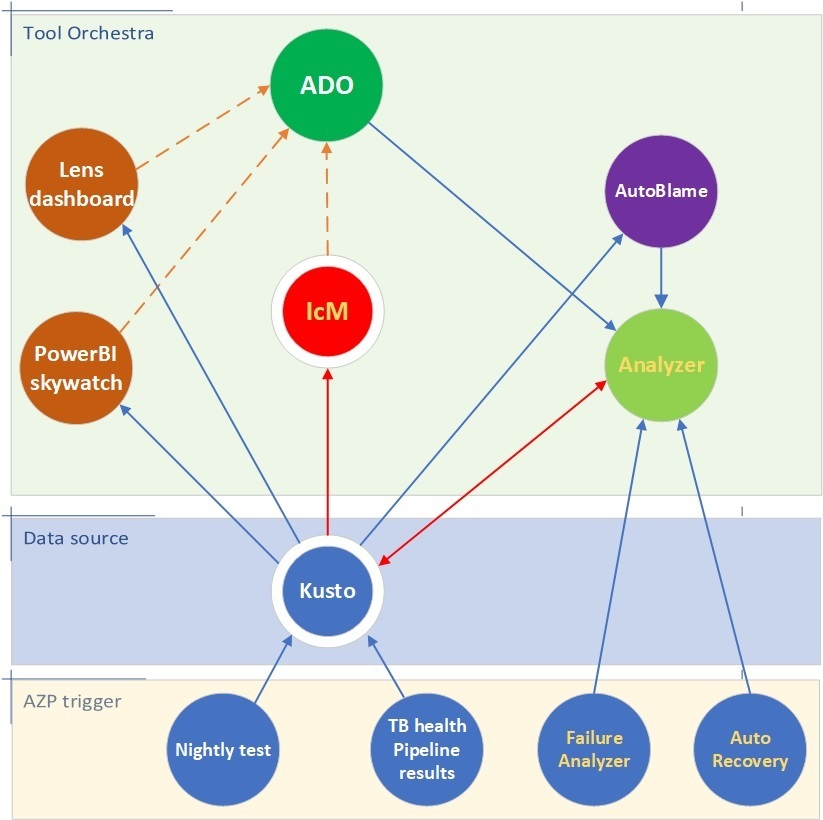
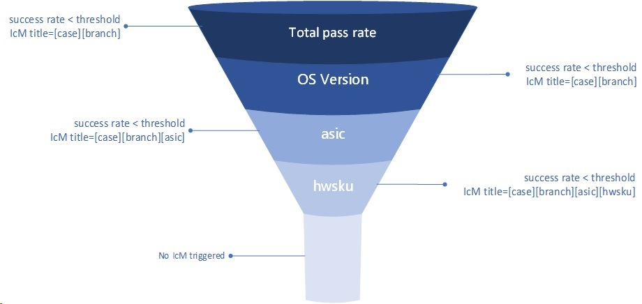

<!-- omit in toc -->
# Nightly Hawk #

<!-- omit in toc -->
## Table of Content
- Revision
- Overview
- Scope
- High-Level Design
- Testing
- Open questions

### Revision

| Rev |     Date    |       Author       | Change Description                |
|:---:|:-----------:|:------------------:|-----------------------------------|
| 0.1 |   2022-11   |   Zhaohui Sun      | Initial version                   |

### Overview

There are so many pipelines run SONiC nighly test every day, accross different testbeds and different branches.
It's huge amount of work to triage every failed test case daily and check every failed pipeline in time.

We involve nightly hawk system to do some automation work, analyze common failures and auto recover unhealthy testbed.
Surface failed cases and unrecovered testbeds out by IcM, collect all infromation and keep everything in one page of IcM.

Nightly Hawk is a system to help us triage for SONiC nighly test. It has two parts, one is test failure analyzer,
another is testbed auto recovery.

### Scope

The scope of this document covers the architecture of nighly hawk, the design of test failure analyzer and auto recovery.

### High-Level Design

The overview of nightly hawk looks like the following:

The whole system is data driven, all data is in Kusto, even IcM.
Lens dashboard/PowerBI/AutoBlame are existing useful tools, the yellow color ones(IcM, Analyzer, AZP Failure Analyzer and AZP Auto Recvoery) are new added.
The system leverages IcM to generate alert and send notification for failed cases and unhealthy testbeds to SONiC nightly guard team. In the IcM, collect all related and userful information for this failed case or unhealthy testbed.

Failure Analyzer and Auto Recovery have script ran at brackgroupd, they are triggered by AZP regularly. 

Generally, nightly hawk can report regressions, recover unhealthy testbeds and send alert automatically.

### Test Failure Analyzer

These are several features Failure Analyzer has:
- Auto pre triage for nighly test
- Display analyzed results from different perspectives In IcM
- Integrate with ADO and Autoblame

The workflow of Test Failure Analyzer:
1. Collect failed cases in 7 days by running kusto query, it uses case + branch as query condition. Idealy, all branches can be covered in a week.
 It only cares test results whose total case number is higher than 100, it excludes some unhealthy pieplines' result which always has testbed issue.
 This makes test analysis more accurate.

2. Sort failed cases with reproduced count which is based on latest run date's results, summarize it to get count by case name, os version and result.
 Currently, it filters those common failures out which reproduced count is equal or higher than 2.

3. Query 30 days’ results for these failed case. Calucate success rate from different perspectives, such as total pass rate, per os version, per asic and per hwsku.
 The filter out process looks like the following funnel.
 

It treats test case plus branch as a filter. If the total success rate over 30 days' is lower than threshold, it will trigger an IcM with title [test case][branch] and exit this scenario.
If the whole success rate is higher than threshold, it will look deeper and check its every os version's success rate.
If the failure is a regression, it may only happens on latest OS version, introduce OS version level can help us to catch regressions as soon as possible.
If all OS version success rate is highter than threshold, will further check asic level's success rate, asic here is vendor, such as broadcom, mellanox. 
If it's lower than threshold, it will trigger an IcM with title [test case][branch][asic] and exit. 
If some asic's success rate is higher than threshold but not 100%, it will look into hwsku level, the same check happens here, if  success rate of some hwsku is lower than threshold, 
it will trigger an IcM with title [test case][branch][asic][hwsku] and exit.

It works like a funnel, if case fails almost on every platform, just one IcM for it, case name and plus branch. But for those cases failed on specific asic or hwsku, 
it can identify them and generate IcMs to let us know what kind of test cases they are.
It's desgined like this is just want to filter out common failures from accurate level and pay attention to higher failed rate scenarios. 

4. For reducing overwhelming number of IcMs:
  - Not trigger lower level IcM if higher level IcM exists.
  - Trigger module path level IcM for test setup failures. If it hits test setup error, every case under this module path will have same setup error as well. Aggregate whose errors into one IcM.
  - Limit IcM number for particular modules, such as everflow and acl, because there are so many cases for these 2 features, normaly, if it has some common reason, high scale failures will happen.
  - Don’t trigger IcM for duplicated items avoid IcM throttling.

5. If one case needs to be generated IcM, set its trigger_icm to True, for other duplicated items, set trigger_icM to False.
Upload these analyzed results to Kusto. Geneva will get the metrics if there is new uploaded data in Kusto.
Geneva monitor will tigger IcM for those trigger_icm = True failure cases.
For duplicated items, IcM automation will render active IcM with latest analyzed results to keep it refreshed daily.

6. It also searches exisiting ADO work items to check if there are related work items raised before. Also integrates with AutoBlame, to check if the failure is introduced by recently commit.
These information will be displayed in IcM as well.

7. Generate 30 new IcMs every day, but eventually, all failures will be surfaced out, regressions will be reported.

8. Auto mitigate IcM if no more new failure for 15 days.

9. Keep every configuration in config file `test_analyzer/test_failure_config.json`. Support flexible configuration and adjustment.

[test_failure_analyzer](https://dev.azure.com/mssonic/internal/_build?definitionId=670) pipeline will run daily, it will generate IcMs with title "[SONiC_Nightly][Failed_Case][test_case_name][branch_name][hwsku_name]".

### Auto Recovery

#### IcM contents
- TSG
- Analyzed results 
- Nightly test results
- Related ADO work items
- Related commits
- Autoblame / SONiC nightly test work item link
- Testbed IP/console info and recovery detailed operation info

### Testing

### Open questions
How to balance duplication and accurancy?
how to catch regression accurately in the first place?
